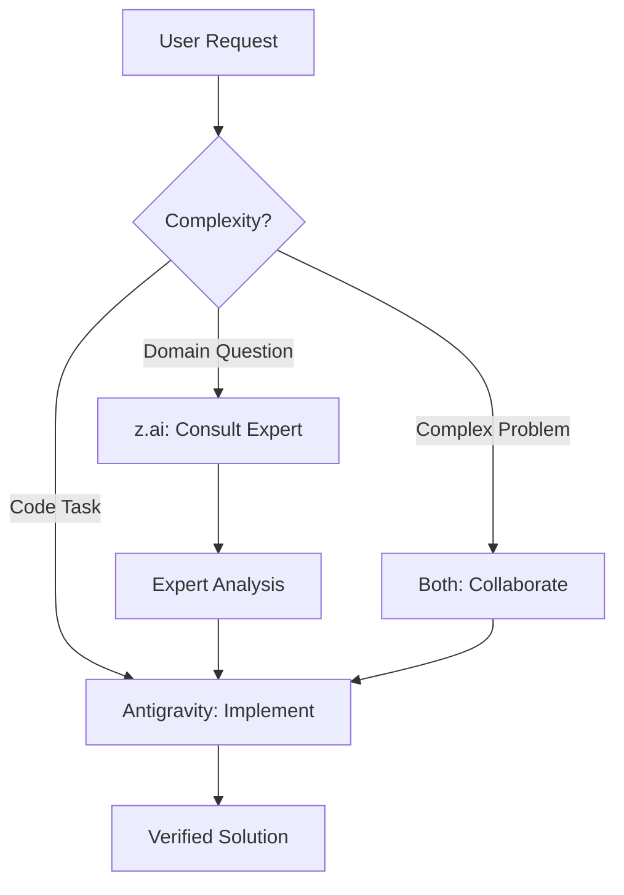

# Trading Platform Workspace Rules

## Global Assistants

This workspace integrates two AI assistants working together:

### 🤖 Google Antigravity IDE
Primary development assistant for:
- Code implementation and editing
- File management and navigation
- Command execution and debugging
- Browser testing and automation

### 🧠 z.ai Expert Team (via `zread` MCP)
Domain experts providing specialized knowledge:

| Expert | Specialization | When to Consult |
|--------|----------------|-----------------|
| **Finance** | Markets, Trading, Risk | Trading strategy design, orderflow analysis |
| **Engineering** | Architecture, Performance | System design, latency optimization |
| **Data Science** | ML, Signals, Analytics | Pattern detection, feature engineering |
| **Security** | Compliance, Secrets | API security, key rotation |

---

## Environment Setup

### Required API Keys

```powershell
# z.ai Expert Team (ALREADY CONFIGURED ✅)
$env:Z_AI_API_KEY = "your-z-ai-key"

# Market Data Providers
$env:ALPACA_API_KEY = "your-alpaca-key"
$env:ALPACA_API_SECRET = "your-alpaca-secret"
$env:MASSIVE_API_KEY = "your-massive-key"

# Broker APIs
$env:ZERODHA_API_KEY = "your-zerodha-key"
$env:UPSTOX_API_KEY = "your-upstox-key"
```

### Permanent Setup (Windows)
```powershell
[Environment]::SetEnvironmentVariable("Z_AI_API_KEY", "your-key", "User")
```

---

## Workflow: Antigravity + z.ai



### Usage Pattern
1. **Simple code tasks** → Antigravity handles directly
2. **Trading strategy questions** → Consult z.ai Finance expert first
3. **Architecture decisions** → Get z.ai Engineering input
4. **Complex problems** → Use sequential-thinking + z.ai

---

## Project Context

**Trading Platform** - Advanced algorithmic trading system:
- Real-time L2 data streaming (Alpaca, Massive)
- Orderflow/footprint pattern detection
- AI-powered signal generation and aggregation
- Multi-broker execution (paper + live)

## Code Standards

| Area | Stack |
|------|-------|
| **Backend** | Python 3.11+, FastAPI, Pydantic |
| **Frontend** | Next.js 14+, TypeScript, React |
| **Infrastructure** | Docker, docker-compose, GitHub Actions |
| **Testing** | pytest (Python), Jest (TypeScript) |

## MCP Servers

| Server | Purpose | Status |
|--------|---------|--------|
| `zread` | z.ai expert team | ✅ Configured |
| `vercel` | Vercel deployments & CDN | ✅ Configured |
| `supabase` | Database & auth | ✅ Configured |
| `trading-orderflow` | L2 data + footprints | ✅ Ready |
| `trading-aggregator` | Signal unification | ✅ Ready |
| `trading-broker` | Order execution | ✅ Ready |
| `sequential-thinking` | Complex reasoning | ✅ Available |
| `firebase-mcp-server` | Firebase ops | ✅ Available |
| `mcp-server-neon` | Database ops | ✅ Available |
| `github` | GitHub operations | ✅ Available |

---

## Quick Commands

```powershell
# Start backend services
docker-compose up -d orderflow-service aggregator-service broker-service

# Start frontend
cd frontend/web && npm run dev

# Run tests
python -m pytest backend/tests/ -v
```
