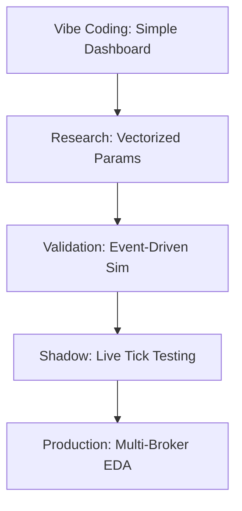

# Backtesting & Research Roadmap

Moving from prototype "vibe coding" to a robust, institutional-grade quant strategy requires a systematic approach.

## Phase 1: Rapid Idea Research (Vectorized)
**Goal:** Test thousands of parameter combinations in seconds.
- **Engine:** `backend/services/backtesting/high_speed.py`
- **Method:** NumPy/Pandas vectorized operations.
- **Data:** Financial Modeling Prep (FMP) or polygon.io historical aggregates.
- **Outcome:** Heatmaps of parameter performance (e.g., SMA 50/200 vs 10/50).

## Phase 2: High-Fidelity Simulation (Event-Driven)
**Goal:** Account for the reality of the market.
- **Engine:** `backend/services/backtesting/backtest_service.py` (VectorBT/Backtrader)
- **Method:** Individual tick/bar processing.
- **Factors:**
    - **Slippage:** The difference between expected and executed price.
    - **Commissions:** Trade fees and impact on CAGR.
    - **Order Latency:** Simulating the time delay between signal and fill.

## Phase 3: Shadow Trading (Paper Integration)
**Goal:** Test against live market dynamics without capital risk.
- **Engine:** `backend/services/broker/router_service.py` -> `PaperBroker`
- **Method:** Real-time data feed (from `market_data.py`) trigger signals to the virtual account.

## Phase 4: Production (Institutional Execution)
**Goal:** Reliable, low-latency execution.
- **Platform:** Event-Driven Architecture (EDA) via `MessageBus`.
- **Infrastructure:** Redis for state, Kafka for event persistence, KEDA for scaling.
- **Brokers:** Alpaca (US), Zerodha (India), Interactive Brokers (Global).

---

### Quantitative Workflow Summary

